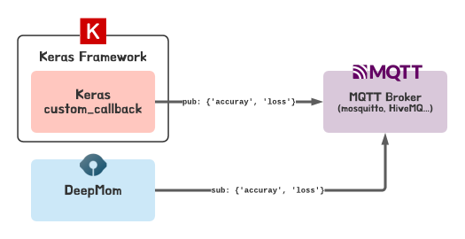
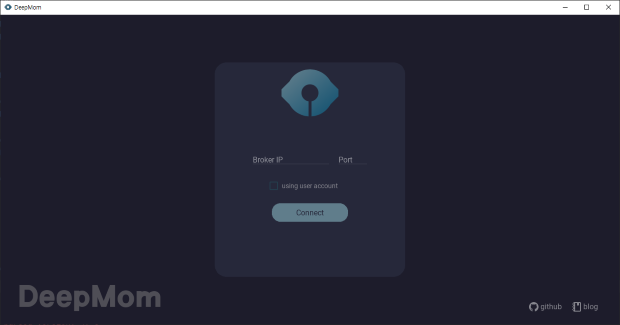
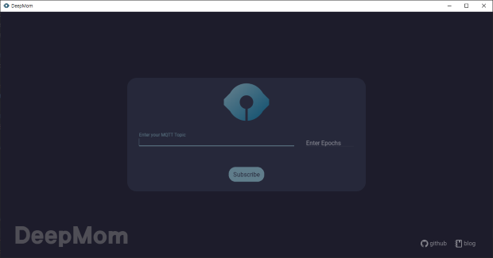
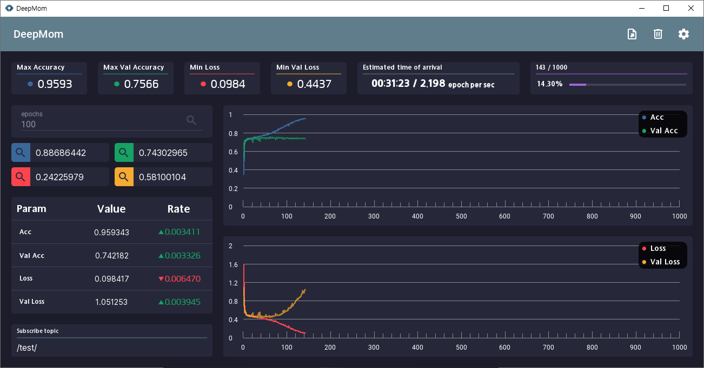

# DeepMom 

   


DeepMom is a simple keras framework monitoring tool using the MQTT protocol.

## Description



The system architecture is very simple. DeepMom connects to the MQTT broker and subscribes to a topic predefined by the user. The Keras framework also publishes learning results at the end of every epoch after connecting to the MQTT broker using a custom callback. 

DeepMom and deeplearning servers are transparent to each other and only send and receive messages to and from the MQTT broker. Therefore, you cannot make any commands or requests to the deeplearning server using DeepMom, only monitoring.

## Install

DeepMom can be installed using PIP. Therefore, Python and PIP must be installed on your PC.  If you have Python and PIP ready, just follow the procedure below.


First clone or download This Project.

```bash
https://github.com/cheesam31/DeepMom.git /path/your/workspace
```

Second create virtual environment.

```bash
python3 -m venv .venv
. .venv/bin/activate
```

Third install requirement library and run.

```bash
pip install -r requirement.txt
python3 main.py
```

## Usage

How to use DeepMom is as follows.

### DeepMom Side

First, users need to connect DeepMom to a private broker like Mosquitto or a public broker like HiveMQ.  If you press Enter without entering anything, you will be connected to port 1883 on localhost.



If you want to input ID and password using TLS provided by paho-mqtt, check the checkbox.	

After that, the user defines the user's topic and sets the deeplearning training epoch (the epoch must be an integer).



### Keras Side

Before starting training, the user should define the CustomCallback class and pass it as an argument to the callback before calling the keras fit function. The basic form of CusotmCallback class is as follows.

```python
class CustomHistory(Callback):
    def __init__(self):
        self.client = mqtt.Client()
        self.client.connect("localhost", 1883, 60)
        self.client.loop_start()

    def on_epoch_end(self, batch, logs={}):
        self.client.publish('/test/', json.dumps(logs), 0)
```

If you want to use ID and password using TLS, you can use it as follows.

```python
class CustomHistory(Callback):
    def __init__(self):
        self.client = mqtt.Client()
        self.client.tls_set(tls_version=mqtt.ssl.PROTOCOL_TLS)
        self.client.username_pw_set(username='username', password='password')
        self.client.connect("your_private_broker_ip", 8883, 60)
        self.client.loop_start()

    def on_epoch_end(self, batch, logs={}):
        self.client.publish('/test/', json.dumps(logs), 0)
```

```python
custom_hist = CustomHistory()
...
model.fit(X_train, Y_train, epochs=epochs, batch_size=batch_size, validation_data=(X_val, Y_val), callbacks=[custom_hist])
```

### UI Description

As mentioned above, DeepMom does not provide as many features as Tensorboad, but only shows the loss, accuracy, validation loss, and validation accuracy for every epoch



If you want to know the value by index, click the mouse and move the cursor to the graph.

* Max Accuracy: Highest accuracy up to the current epoch
* Max Val Accuracy: Highest validation accuracy up to the current epoch
* Min Loss: Lowest loss up to the current epoch
* Min Val Loss: Lowest validation loss up to the current epoch

Value: Accuracy, Loss, Validation accuracy, Validation loss of Current Epoch

Rate: Ratio of ups and downs from the previous epoch
